# Task Master
In this app you can sign up with your email and start adding tasks and filtering them by their team

-25/8/2021
    1. added firebase analytics
        - 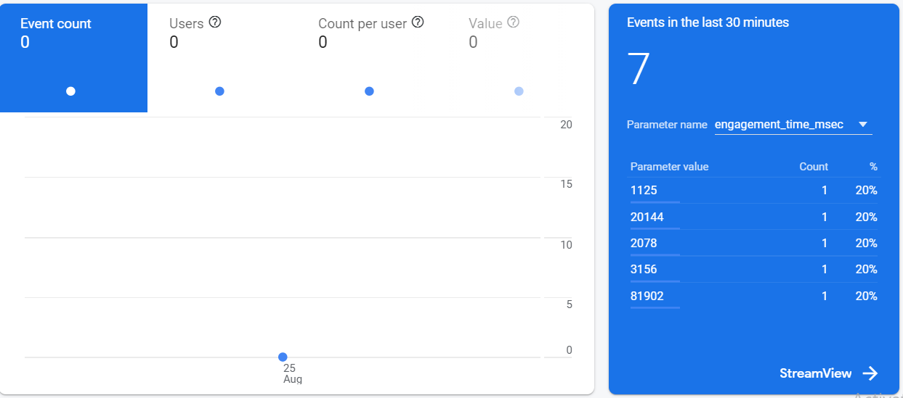

- 24/8/2021
    1. Implemented Notification using amplify and firebase
        - 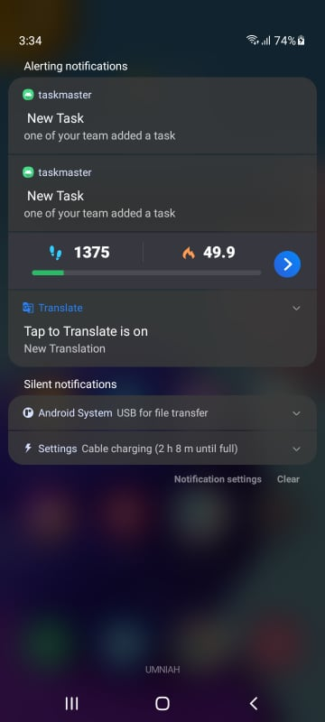

- 23/8/2021
    1. Implemented S3 storage from AWS service
    2. Edited Add Task page so that a user can add a file to that task
       - 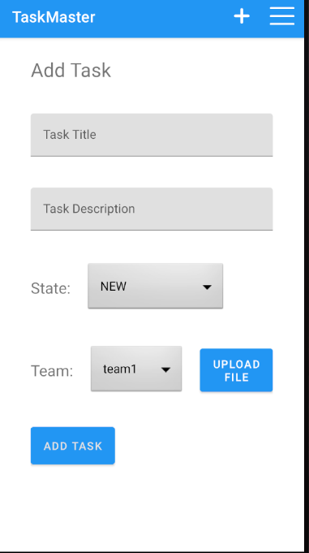
    3. Edited the task details page so that the image will appear as Image view and as a link if it is any other file
       - 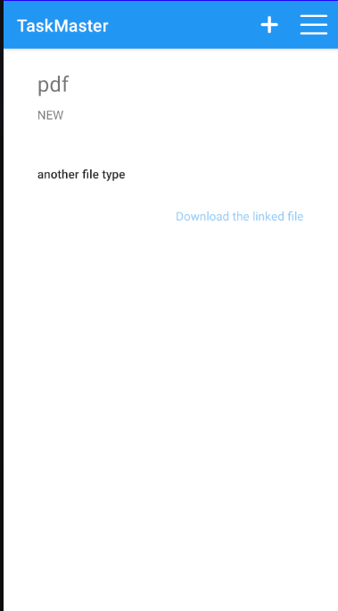

- 22/8/2021
    1. Sign In page to enter into the App
        - 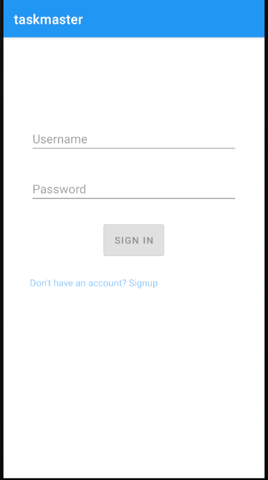
    2. SignUp page to register with new account
        - 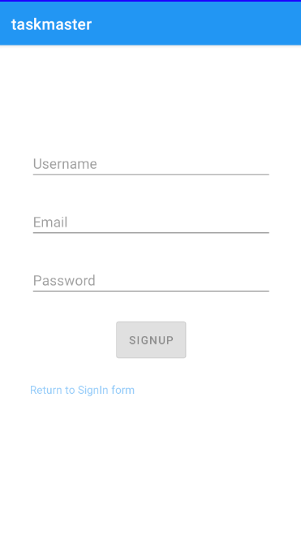
    3. Sign out button in a menu
        - 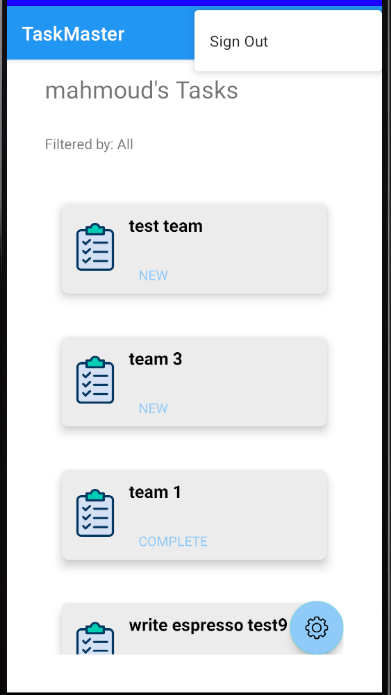
    

- 21/8/2021
    1. build [taskmaster.apk file](./taskmaster.apk)
- 19/8/2021:
    1. Added the Team Schema with a relation od one to many with the task schema
    2. in the setting page I added a spinner to choose between the available teams and then filter the tasks that are displayed on the home page by the team id
    3. in the add task page I added a spinner to assign a team to the task that you want to add
        - 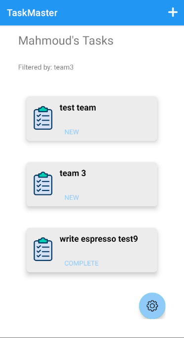
        - 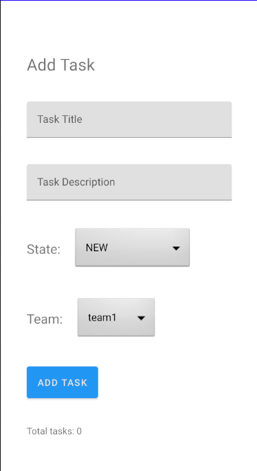
        - 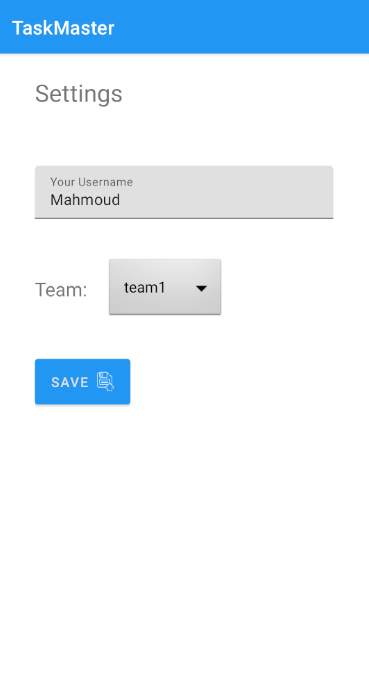

- 17/8/2021: 
    1. Implemented AWS Amplify to access your data in DynamoDB instead of in Room.
    1. store the added tasks in DynamoDB and in Room also to make it available offline (this is a TODO)

- 15/8/2021: [Espresso Tests](app/src/androidTest/java/com/example/taskmaster)
    1. added tests for all of the pages and tests for all of the functionality

- 12/8/2021: Implemented Room database
    1. added the ability to add a new task by filling in the form
    1. the tasks will appear on the home page
    1. in the detail page the info that is related to that task is there like the body
    
- 11/8/2021: updated the home page:
    1. I created a recycler view to display all of the tasks in the home page, and when you click on any one you will go to that task detail page with add task button in the header.

- 9/8/2021: created 2 pages:
    1. Task Detail page to give a simple detail about a each task
        - 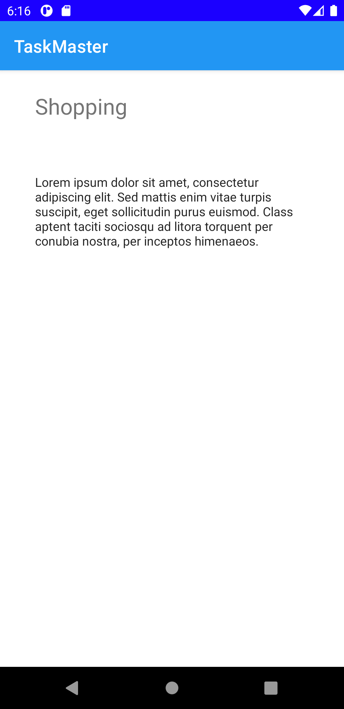
    1. Setting page to allow the users to enter their username and store it in the storage
        - 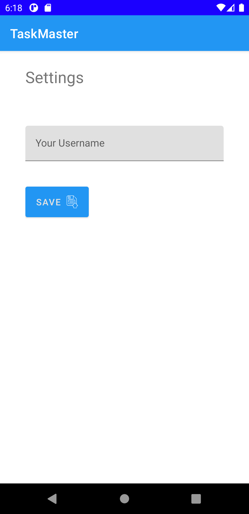
- 8/8/2021: created 3 pages:
    1. Home page to go to the other two pages
        - 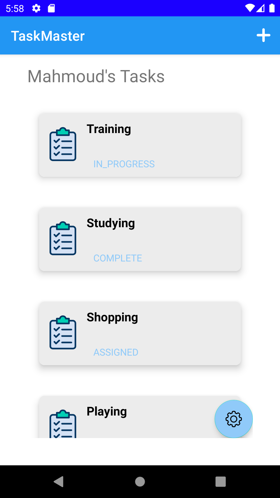
    2. Add task page
        - 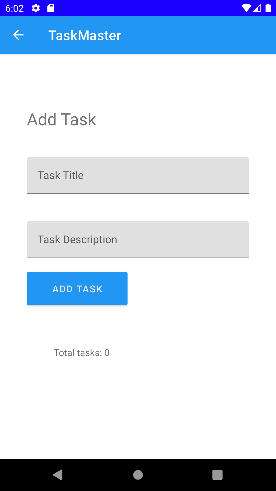
    3. All tasks page
        - 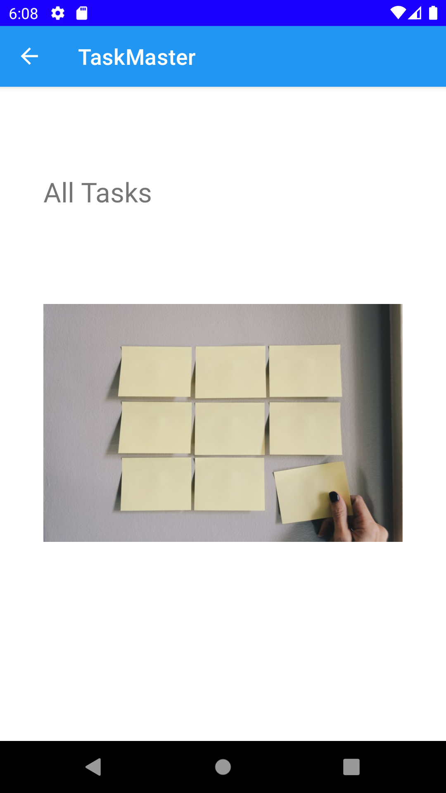
    
    
    
