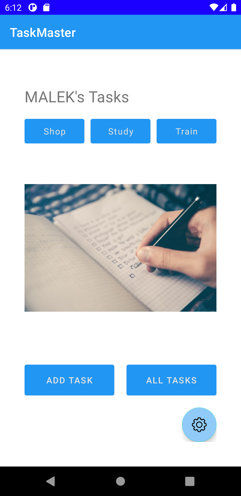

# Task Master

- 8/8/2021: created 3 pages:
    1. Home page to go to the other two pages
        - 
    2. Add task page
        - 
    3. All tasks page
        - 

- 9/8/2021: created 2 pages:
    1. Task Detail page to give a simple detail about a each task
        - 
    1. Setting page to allow the users to enter their username and store it in the storage
        - 